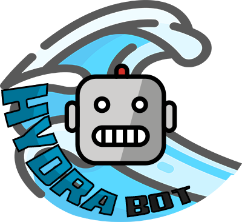

HydraBot
===

**A facebook chatbot** built around [fbchat](https://github.com/carpedm20/fbchat) library, **designed to remember your loved ones to stay hydrated**.


# Contents
* [1. Requirements](#1-requirements)
* [2. Installation](#2-installation)
  * [2.1. Virtual environment](#21-virtual-environment)
    * [2.1.1. Creation](#211-creation)
    * [2.1.2. Activation](#212-activation)
  * [2.2. Python packages](#22-python-packages)
* [3. Usage](#3-usage)
* [4. How it works](#4-how-it-works)
* [5. Configuration](#5-configuration)
  * [5.1. Enable random image messages](#51-enable-random-image-messages)
* [6. Credits](#6-credits)


# 1. Requirements
* [Python3](https://www.python.org/)
  * [pip](https://pypi.org/project/pip/)


# 2. Installation

## 2.1. Virtual environment

To understand what virtual environments are and why you'll want them, see [this document](https://docs.python-guide.org/dev/virtualenvs/#lower-level-virtualenv).

### 2.1.1 Creation

```bash
$ pip install virtualenv # Install virtualenv first
$ cd HYDRABOT_DIRECTORY
$ virtualenv venv # Creates a new virtual environment inside "venv" directory
```

### 2.1.2 Activation
Windows:

```bash
$ source venv/Scripts/activate
```

Linux/Mac OS:

```bash
$ source venv/bin/activate
```

## 2.2 Python packages

```bash
$ pip install -r requirements.txt
```

**On windows** you will need an additional module:
```bash
$ pip install windows-curses
```


# 3. Usage

Remember to [activate your virtual environment](#activation) if you haven't already.

```bash
$ python HYDRABOT_DIRECTORY
```


# 4. How it works
* The bot is active during a given timespan and sends groups of messages
  * Will choose plain text message, emoji message and/or image based on possible texts, emojis, etc. (Minimum one message type, maximum all three types)
  * Randomly chooses amount of message groups to send during given timespan
* Can announce itself by waving first
* Is able to change thread emoji temporarily
* Imitates human behaviour by "typing" before sending and delaying texts
* Modes available:
  * demo - *Doesn't connect to FB* (preview mode)
  * test - *Ignores times*
  * **Modes can be combined or turned off entirely.**


# 5. Configuration
The bot can be configured by modifying the file  ```hydrabot_py/config.py```. As it's very extensive, **it will mostly not be explained here, but rather by comments inside the file**.

## 5.1 Enable random image messages
**This is optional. By default no image messages will be sent.**

In order for random images to work you have to provide required values for Giphy and/or Google Image Search.

**Get started:**
* Set ```image_chance_per_message``` config variable to a value above 0.
* **Optional:** Adjust ```image_gis_giphy_chance``` config variable. (*Explained by comment inside config file*)

**For Giphy:**
1. Obtain [Giphy API key](https://support.giphy.com/hc/en-us/articles/360020283431-Request-A-GIPHY-API-Key)
2. Set ```giphy_api_key``` configuration variable to API key.

**For Google Image Search:**
1. [Create a Google Custom Search](https://developers.google.com/custom-search)
2. Enable Image Search for it
3. Set ```gis_api_key``` to your API key and ```gis_project_cx``` to your project CX.


# 6. Credits
* **Logo:**
  * [Molot font](https://www.dafont.com/molot.font) by Jovanny Lemonad
  * [Robot emoji](https://openmoji.org/library/#search=robot&emoji=1F916) by OpenMoji
  * [Wave icon](https://www.flaticon.com/free-icon/wave_616711) by Flaticon
